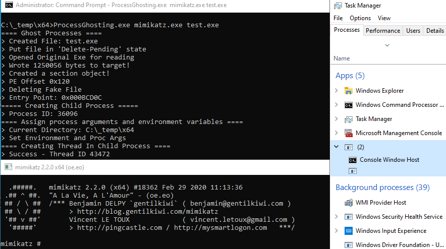

# process_ghosting-Delphi - A PoC for Process Ghosting!

This repository contains proof-of-concept code for Process Ghosting technique on Windows based on https://github.com/whokilleddb/ghosted.

## Execution

```
ProcessGhosting.exe <REAL EXE> <FAKE EXE>
```

where `<REAL EXE>` parameter takes in the path to an executable to be run while `<FAKE EXE>` is the path where the transient file will be created. 

This technique can help evade EDR/AV engines.

<p align="center">
  
</p>

# Contributing

Contributions are welcome! If you have suggestions or bug fixes, please fork the repository and submit a pull request.


<p align="center">Made with ❤️ using Delphi RAD Studio</p>
